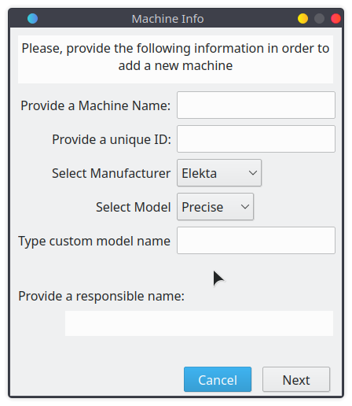
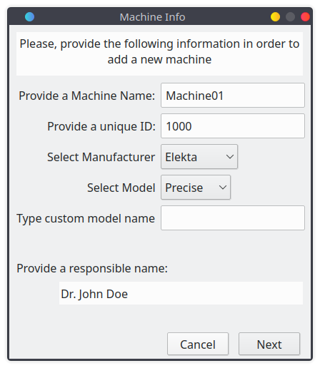
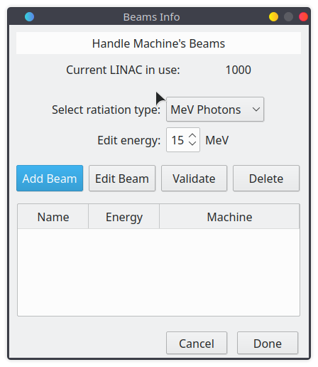
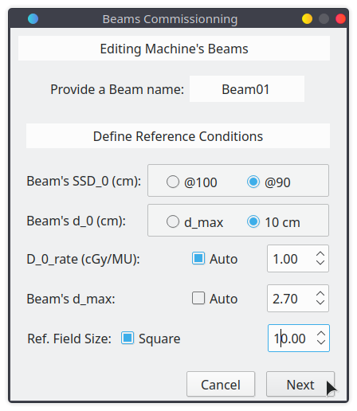
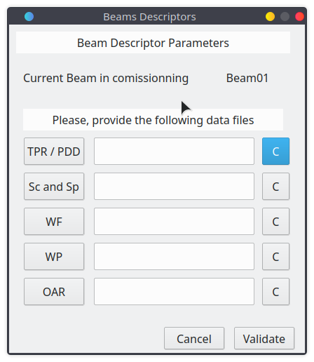
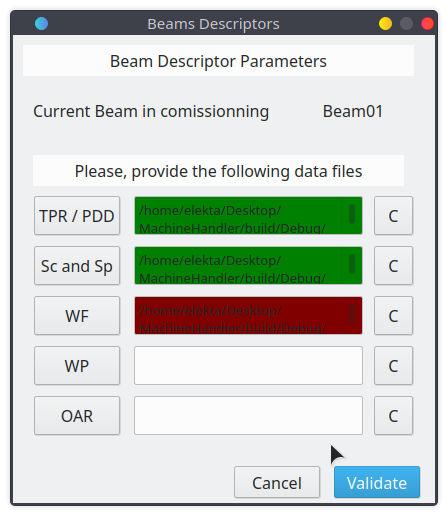

# Help

A [PotatoBite](https://PotatoBite.github.io)'s product. All rights reserved.

* TOC
{:toc}

## Intro ##

MachineHandler is a program intended to be used as submodule of [CheckDoseQt](http://PotatoBite.github.io/products/CheckDoseQt). Its main function is to provide Clinical Physicist with a tool for editing the clinic database used by CheckDoseQt and modify the values that associated Linacs and Beams holds.

###  Creating a Clinic ###

First of all, before using CheckDoseQt, you have to provide through MachineHandler an valid Clinic Database file containing the info about the Linacs and their associated beams you will use in CheckDoseQt.

Naturally, the first task is to create a clinic. A clinic is nothing but an encrypted sqlite DB file containing in tables all the info required for CheckDoseQt to properly work. The database is generated automatically by the MachineHandler module when created and must be mandatory avoided to edit it manually.

In the Clinic Info dialog select `Add Clinic` button to create a new clinic:

When creating a clinic, an encrypted sqlite file is created automatically and there isn't need of man intervention in the process. All required tables, default values and templates are automatically added executing a series of SQL statements sequence, reason which can lead to delays in the process, mainly in old systems.

A Dialog asking you a name for your clinic database file will be prompted. Give your clinic a name, be aware of avoiding the use of spaces or any other character language dependent as **"ñ"** or **"@"**. For guiding purposes, will be using *"OurClinic"* as our default clinic name in the present Help.

After creating a clinic, the clinic selector must be updated with the value of the selected clinic:

----

### The Clinic Selector ###

MachineHandler provides a selector of valid Clinic Database files through a combo box selector Widget. Changing the selected widget updates the Linacs' Table in the downside of the Dialog. 

The Linacs' table shows the Linacs defined in the current selected clinic, their ID, Name and State. If no Linac has been defined yet,  the table is show empty.

When creating a new Clinic, the Clinic Selector updates its internal list of clinic files present at the Runtime directory.

----

### Editing a Clinic ###

When the `Edit Clinic` button is clicked, a Dialog asking a new for your clinic is showed. Providing  a new name for your clinic and accepting the dialog makes that the selected clinic changes its names. 

> **WARNING:** Please, be sure of avoid running 2 instances of MachineHandler and editing a clinic in a primary instance while doing any other operation 	over the same clinic in another instance. It could cause **irreversible** **errors** in the clinic database file.

----

### Deleting a Clinic ###

Deleting a clinic is a process that involves user authorization through the system interface for elevated privileges since is not a trivial task but a destructive task. To delete a clinic, which must be interpreted as the deletion of the information related to the clinic and the physical elimination of the file containing these data, please click the `Delete Clinic` button after selecting a clinic through the Clinic Selector combo box. 

----

## Moving Forward ##

### Adding Linacs to you Clinic ###

Adding a Linac is as simple as clicking the `Add Linac` button after selecting the clinic at which you want to store your Linac with the Clinic selector combo box. A dialog containing mandatory fields to be fill by user is showed. 

#### The Machine Info Dialog ####

> Note: Be sure of using **UNIQUES IDs** for your Linac since they are indexed using this property in the database.

The fields must match the following properties to be accepted.

| Parameter        | Value                                                        | Information                                         |
| :--------------- | :----------------------------------------------------------- | --------------------------------------------------- |
| Machine Name     | 4-12 alphanumeric characters                                 | Name showed for the current Linac in DB             |
| ID               | 4-12 numeric characters                                      | ID for access the current Linac in CheckDoseQt      |
| Manufacturer     | Select between available values                              | -                                                   |
| Model            | Select between available values                              | -                                                   |
| Custom Model     | Define a custom model name if available don't match your Linac | -                                                   |
| Responsible Name | Up to 40 alphanumeric characters:                            | Person in charge of commissioning the current Linac |

After complete filling the fields, click the `Next` button to start defining **Beams** for your **Linac**.

#### The Beam Info Dialog ####

The Beam Info Dialog contains an Energy selector and Energy type selector. Additionally, a Beam table is showed in the downside, similar to the one that is showed in the Clinic Info Dialog. The table shows the Beams that belongs to the current selected Linac. If no Beam has been created yet, is normal that the tables is in a empty state.

After the Linac is created, at least Beam must be added and validated before using it in CheckDoseQt. 

----

### Adding a Beam ###

Click the `Add Beam` button in order to add a new Beam to the currently edited Linac in the database.  

>  Note: Before adding a Beam, be sure of selecting the proper energy value and particle type.

#### Beams Commissioning ####

A dialog asking for mandatory information must be showed:

Mandatory fields must be filled in order to accept and continue to the next stage. For completing this task, values introduced in the present and forward dialog must be [AAPM TG-114](https://aapm.onlinelibrary.wiley.com/doi/abs/10.1118/1.3521473). compliant. Some of them are showed here for reference only, for more information about the definition of these parameters, please, refer to the [AAPM TG-114](https://aapm.onlinelibrary.wiley.com/doi/abs/10.1118/1.3521473).

| Parameter       | Information                                                  |
| --------------- | ------------------------------------------------------------ |
| Beam Name       | Provide a Beam Name to improve identification                |
| SSD_0           | The source to phantom surface distance for the normalization conditions and reference dose rate. |
| d_0             | Normalization depth for the dosimetric system: the depth at which depth sensitive parameters take on a value of 1 or 100% |
| D_0_rate        | The dose rate at the normalization depth of d_0 for the reference field size r_0. Typically set to 1 cGy/MU. |
| d_max           | Normalization depth of maximum, tipically set to the depth of maximum (d_max) when SSD_0 = 100. |
| Ref. Field Size | The reference field size (r_0) for the treatment modality that defines the reference dose rate D |

After completing filling the parameters, click `Next` to start providing the Beam Descriptor files in the following Dialog.

----

#### Beam Descriptors ####

The next dialog is intended to be used for directly import into database the files that contains the data of each beam. After the a beam is created, you will need to import the Beam's descriptor parameters files. 

The descriptors parameters, once again according to  [AAPM TG-114](https://aapm.onlinelibrary.wiley.com/doi/abs/10.1118/1.3521473) are:

- TPR: Tissue-Phantom Ratio
- PDD: Percent Depth Dose
- PDD_n: Percent Depth Dose Normalized
- Sc: Collimator Scatter Factor
- Sp: Phantom Scatter Factor
- WF: Wedge Factor
- WP: Wedge Profiles
- OAR: Off-Axis Ratio

In MachineHandler you must provide the beam descriptors files as following:

| File      | Containning         | Rules                                                        |
| --------- | ------------------- | ------------------------------------------------------------ |
| TPR.txt   | TPR or PDD or PDD_n | - Most left, most up value must be 0.                        |
|           |                     | - 1st column is depth, descending from 0 to max_depth        |
|           |                     | - 1st row is equivalent square field size from 0 to max_eq_field_size |
| Sc_Sp.txt | Sc & Sp             | - 1st column are equivalent square field size from 0 to max_eq_field_size |
|           |                     | -  2nd column is Sc                                          |
|           |                     | - 3rd column is Sp                                           |
| WF.txt    | WF                  | - @todo                                                      |
| WP.txt    | WP                  | - @todo                                                      |
| OAR.txt   | OAR                 | - @todo                                                      |

To import a descriptor file into Beam parameter data, use the load button related to the parameter you want to load:

Each button opens a Dialog asking for the file to import. Some filters have been defined to support the importation process. When selecting a valid file, the label in the middle will show the rout of the selected file.

The `C` button aside each label clears the value of the selected file, in case you confused and selected a wrong file in a different category or similar.

Once you have selected all files you want to import, clicking the `Validate` button will trigger a series of revision of given files in order to detect anomalies or irregularities. When the tests finish, you will see some Dialogs giving information about the result of the checking process, and asking you if want to come back to (maybe) re-enter some files.

If the file passes the test, its label is showed in dark green background, if it doesn't pass the test, it will be showed in a red background color, like in the previous picture.

----

#### Finishing the addition of beams #####

Once you have validated all the files needed by the Machine you can close the Dialog accepting the prompts showed after clicking the `Validate` button.

It will bring you back to the `Beams Info` dialog to keep adding beams to your editing *Linac* or maybe to complete the commissioning process .

### Editing Linacs and Beams ###

@todo

For the full reference guide for the version of Markdown used to render Chromium
pages, see the [reference for Gitiles Markdown][gtref].

## Forward MD reference 

[gtref]: https://gerrit.googlesource.com/gitiles/+/master/Documentation/markdown.md
